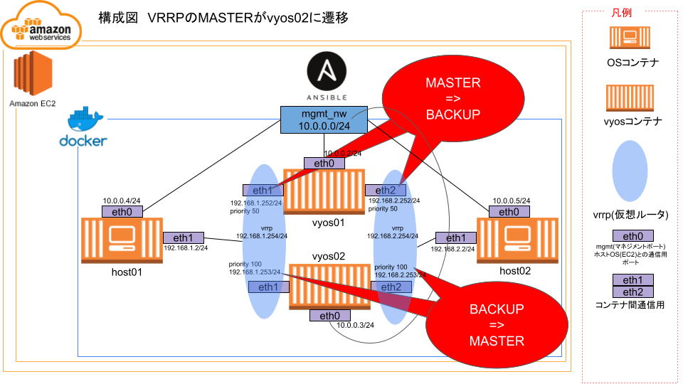
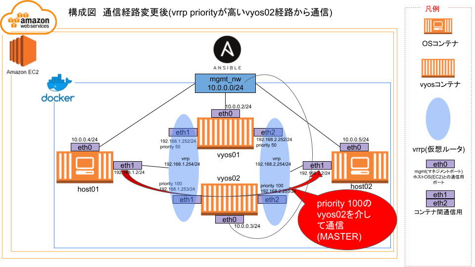

# 2024年度新卒向け Ansible自動化研修
## 2024/6/6

---

<!--
class: slide
paginate: true
-->

# 今日のプログラム
- 講師の自己紹介
- 新卒のみなさまの自己紹介
- 自動化のメリットとデメリット
- Ansibleとは？？
- Ansibleを体験するための環境構築（ハンズオン）
- Ansibleを実行してみよう（ハンズオン）
- この自動化をもっとよくするには？
- 感想・質疑応答

---

# 講師の自己紹介

### 佐々木 志穂（ささき しほ）

- 所属：BzD部 ACT NW自動化横串T
- 年齢：25
　　　<br>中途未経験で入社してもうすぐ5年です
- 趣味：ライブにいくこと、旅行、ゲーム実況をみること
- 今日の意気込み：できるだけ分かりやすくを心がけます。本日はよろしくお願いします！

### 佐藤 丞（さとう たすく）

- 所属：MBS部 RCOA NW自動化横串T
- 年齢：26
　　　<br>前職でNW運用監視を経験後、昨年6月にAPC入社しました
- 趣味：旅行、キャンプ、寝ること(最近登山も追加されそう)
- 今日の意気込み：なんでも遠慮なく聞いてください！

---

# 新卒のみなさまの自己紹介
名前・所属・趣味などを、1人1分程度でお願いします！

# 自動化のメリットデメリット

## メリット
- 1つ1つ手動で設定 → 1回の実行で自動で設定することができる
- 間違い・作業ミスが減る
- 作業が構造化される

## デメリット
- コードを書く人が必要
- 対応している機器・対応していない機器がある
→ 自動化した方が複雑になってしまうケースがある
- エラー時の原因特定が難しい

---

# Ansibleとは？
資料(Ansible研修講義資料_20240413(Ansibleとは).pptx)のp3～p6

---

# Ansibleを体験するための環境構築

### 1. AWSにログイン
   - Gmail → Googleアプリ → AWS for APC を選択

### 2. AWSでEC2インスタンスを立てる
  - Meetの画面を見ながら、EC2インスタンスを起動していきましょう。

### 3. TeraTermでEC2インスタンスにログイン
  - TeraTermを起動
  - EC2インスタンスのパブリックIPアドレスにSSHログイン
  - ユーザ名：ec2-user パスフレーズ：空欄
  EC2インスタンスを立てたときにダウンロードした、秘密鍵のpathを指定します

以下のようなイメージでプロンプトが返ってくることを確認する

```shell
[ec2-user@ip-172-31-38-211 ~]$
```

---

### ここからはTeraTermで実行してください。

### 4. gitをインストール

```shell
sudo dnf install -y git
```

### 5. githubから資材を配置しているリポジトリをclone

```shell
git clone https://github.com/apc-nw-auto-cft/ansible_on_vyos.git
```

### 6. シェルスクリプトを実行して、dockerとpoetryをインストール

```shell
cd ~/ansible_on_vyos

sh ./init.sh
```

---

### 7. ここで再度ec2-userでssh login
altキー + D で再ログイン(新しいウィンドウが立ち上がります)

### 8. sudo なしでdockerコマンドを打てることを確認(errorにならなければOK)

```shell
docker ps
```

### 9. poetry環境ログイン

```shell
cd ~/ansible_on_vyos

poetry shell
```

以下のように出力されプロンプトが変化したことを確認する(先頭に「(ansible-on-vyos-py3.9) 」と付くこと)

```shell
Spawning shell within /home/ec2-user/ansible_on_vyos/.venv
[ec2-user@ip-172-31-38-211 ansible_on_vyos]$ . /home/ec2-user/ansible_on_vyos/.venv/bin/activate
(ansible-on-vyos-py3.9) [ec2-user@ip-172-31-38-211 ansible_on_vyos]$
```

### 10. dockerコンテナの作成、起動

```shell
docker-compose -f ./init_settings/docker-compose.yml up -d
```

### 11. test用のplaybookを実行

```shell
ansible-navigator run ./ansible_practice/test.yml
```

---

# Ansible playbookを実行する

## playbook実行前の状態


## playbookを実行して、VRRPのプライオリティ値を150→50に変更する。


## VRRPのMASTERとBACKUPが入れ代わる


## vyos01のVRRPのプライオリティ値を150→50に変更したことで、vyos02のVRRPプライオリティ値の方が高くなる


---

## Ansible playbookの説明
資料(Ansible研修講義資料_20240413(Ansibleとは).pptx)のp8～p20

---

## 今回使用するAnsible playbook
https://github.com/apc-nw-auto-cft/ansible_on_vyos/blob/main/ansible_practice/link_bypass/link_bypass_simple.yml #FQCN等改修します

---

## 1. playbook実行前状態確認（tracerouteで経路確認）

```shell
docker exec host01 traceroute 192.168.2.2
```
vyos01.service_nw01 (192.168.1.252)経由であることを確認

```shell
docker exec host02 traceroute 192.168.1.2
```
vyos01.service_nw02 (192.168.2.252)経由であることを確認

### 2. vrrp値を変更するplaybookを実行

```shell
cd /home/ec2-user/ansible_on_vyos/ansible_practice/link_bypass

ansible-navigator run link_bypass_simple.yml -i inventory.ini 
```

### 3. playbook実行後状態確認（tracerouteで経路確認）

```shell
docker exec host01 traceroute 192.168.2.2
```
vyos02.service_nw01 (192.168.1.253)経由であることを確認

```shell
docker exec host02 traceroute 192.168.1.2
```
vyos02.service_nw01 (192.168.2.253)経由であることを確認

---

# Ansible playbookを作成して実行する

## 迂回戻しのplaybookを作成してみよう
- 先ほどのplaybookを実行したことで、vyos02を通るようになった
- vyos01を通るようにするplaybookを作成してみよう

## ヒント
- 先ほど実行したplaybookを、別名義でコピーする
- コピーしたplaybookに書いているVRRPのプライオリティ値を変更してみる

---

# この自動化をもっと良くするには？
1人1ずつ(1つ以上でも！)案を出してみましょう

---
