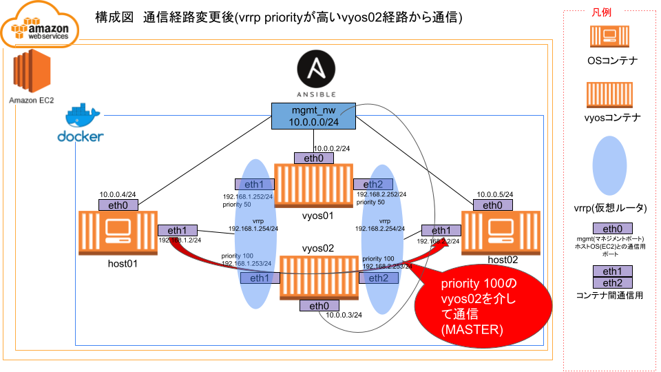

# 2025年度新卒向け Ansible自動化研修 
## 2025/6/17

---

<!--
class: slide
paginate: true
-->

## 今日のプログラム
- 講師の自己紹介
- 新卒のみなさまの自己紹介
- 自動化のメリットとデメリット
- Ansibleとは？？
- Ansibleを体験するための環境構築（ハンズオン）
- Ansibleを実行してみよう（ハンズオン）
- この自動化をもっとよくするには？
- 感想・質疑応答

---

## 講師の自己紹介

### 相場 涼介（あいば　りょうすけ）

- 所属：BzD部 ACT 
- 年齢：25
　　　<br>23卒で今年3年目のエンジニアになります。
- 趣味：読書、ゲーム、散歩
- 今日の意気込み：Ansibleの面白さ、魅力を分かりやすく伝えらえるように頑張ります！  
本日はよろしくお願いします！

### 中山 千拓（なかやま　ちひろ）

- 所属：BzD部 ACT 
- 年齢：26
　　　<br>前職でNW運用監視を経験後、昨年6月にAPC入社しました
- 趣味：旅行、キャンプ、寝ること(最近登山も追加されそう)
- 今日の意気込み：なんでも遠慮なく聞いてください！

---

## 新卒のみなさまの自己紹介
名前・所属・趣味などを、1人1分程度でお願いします！

---

## 自動化研修の目的

### とりあえず自動化を体験してほしい
- 今日は自動化を体験してもらうにあたり、Ansibleを使用します。Ansibleによって操作が自動化されているところをとりあえず体験してほしいです。
- この後Ansibleコマンドを実行していただきます。そのとき、複数の操作が自動化されているところを確認できたらOKです。

---

## 自動化のメリットデメリット

### メリット
- 1つ1つ手動で設定 → 1回の実行で自動で設定することができる
- 間違い・作業ミスが減る
- 作業が構造化される
  - 作業を整理整頓し、わかりやすく書くこと
  - 誰がやっても同じ結果を得られるようにすること
  - 繰り返し使えるように作業をまとめること  

```shell
---
- name: Deploy web server
  hosts: web_servers
  tasks:
    - name: Install Apache package
      ansible.builtin.yum:
        name: httpd
        state: present

    - name: Deploy HTML file
      ansible.builtin.copy:
        src: index.html
        dest: /var/www/html/index.html

    - name: Start and enable Apache service
      ansible.builtin.service:
        name: httpd
        state: started
        enabled: yes
```

### デメリット
- コードを書く人が必要
- 対応している機器・対応していない機器がある
→ 自動化した方が複雑になってしまうケースがある
- エラー時の原因特定が難しい

---

## Ansibleとは？
資料(Ansible研修講義資料_20250413(Ansibleとは).pptx)のp3～p6
リンク追加する

---

## Ansibleを体験するための環境構築 (AWSコンソール)

### 1. AWSにログイン
   - Gmail → Googleアプリ → AWS for APC を選択

### 2. AWSでEC2インスタンスを立てる
  - Meetの画面を見ながら、EC2インスタンスを起動していきましょう。
  - インスタンス基本設定
    - インスタンス名: APCメールの@の前にあるユーザー名
    - タグ追加：キーにdo_not_stop、値にplease
    - AMI: Amazon Linux 2023 AMI
    - インスタンスタイプ: t3.medium
    - キーペア: 新しいキーペアの作成→アドレス名
    - キーペアタイプ：RSA
    - ファイル形式: .pem

  - ネットワーク設定
    - 右上の編集をクリック
    - VPC: デフォルト(172.31.0.0/16)
    - サブネット: subnet-d44e1c9d
    - パブリックIP自動割り当て: 有効化
    - セキュリティグループを作成
      - launch-wizard-xxx-yy
      - 割り当てられている番号をyyに挿入
        - 原谷さん 01
        - 鈴木さん 02
        - 吉村さん 03
    - インバウンドセキュリティルール
      - タイプ: すべてのトラフィック
      - ソースタイプ: 自分のIPを選択
  
  - インスタンスの起動
    - 画面右下のインスタンスの起動を実行

### 3. TeraTermでEC2インスタンスにログイン
  - インスタンスIDからパブリックIPアドレスを確認します
  - TeraTermを起動
  - EC2インスタンスのパブリックIPアドレスにSSHログイン
  - ユーザ名：ec2-user パスフレーズ：空欄
  EC2インスタンスを立てたときにダウンロードした、秘密鍵のpathを指定します

以下のようなイメージでプロンプトが返ってくることを確認する

```shell
[ec2-user@ip-172-31-38-211 ~]$
```

---

## ここからはTeraTermで実行してください。

### 4. gitをインストール

```shell
sudo dnf install -y git
```

### 5. githubから講義用ファイルを配置しているリポジトリをclone

```shell
git clone https://github.com/apc-nw-auto-cft/ansible_on_vyos.git
```

### 6. シェルスクリプトを実行して、dockerとpoetryをインストール

```shell
cd ~/ansible_on_vyos

sh ./init.sh
```

### 7. ここで再度ec2-userでssh login
altキー + D で再ログイン(新しいウィンドウが立ち上がります)

### 8. sudo なしでdockerコマンドを打てることを確認(errorにならなければOK)

```shell
docker ps
```

### 9. poetry環境ログイン

```shell
cd ~/ansible_on_vyos

poetry shell
```

以下のように出力されプロンプトが変化したことを確認する(先頭に「(ansible-on-vyos-py3.9) 」と付くこと)

```shell
Spawning shell within /home/ec2-user/ansible_on_vyos/.venv
[ec2-user@ip-172-31-38-211 ansible_on_vyos]$ . /home/ec2-user/ansible_on_vyos/.venv/bin/activate
(ansible-on-vyos-py3.9) [ec2-user@ip-172-31-38-211 ansible_on_vyos]$
```

### 10. dockerコンテナの作成、起動

```shell
docker-compose -f ./init_settings/docker-compose.yml up -d
```

### 11. test用のplaybookを実行

```shell
ansible-navigator run ./ansible_practice/test.yml
```

---

## Ansibleを実行してみよう(構成図)

### playbook実行前の状態


### playbookを実行して、VRRPのプライオリティ値を150→50に変更する。


### VRRPのMASTERとBACKUPが入れ代わる


### vyos01のVRRPのプライオリティ値を150→50に変更したことで、vyos02のVRRPプライオリティ値の方が高くなる


---

### Ansible playbookの説明
資料(Ansible研修講義資料_20250413(Ansibleとは).pptx)のp8～p20

---

### 今回使用するAnsible playbook
https://github.com/apc-nw-auto-cft/ansible_on_vyos/blob/main/ansible_practice/link_bypass/link_bypass_simple.yml 

---

## Ansibleを実行してみよう(ハンズオン)

### 1. playbook実行前状態確認（tracerouteで経路確認）

```shell
docker exec host01 traceroute 192.168.2.2
```
vyos01.service_nw01 (192.168.1.252)経由であることを確認

```shell
docker exec host02 traceroute 192.168.1.2
```
vyos01.service_nw02 (192.168.2.252)経由であることを確認

### 2. vrrp値を変更するplaybookを実行

```shell
cd /home/ec2-user/ansible_on_vyos/ansible_practice/link_bypass

ansible-navigator run link_bypass_simple.yml -i inventory.ini 
```

### 3. playbook実行後状態確認（tracerouteで経路確認）

```shell
docker exec host01 traceroute 192.168.2.2
```
vyos02.service_nw01 (192.168.1.253)経由であることを確認

```shell
docker exec host02 traceroute 192.168.1.2
```
vyos02.service_nw01 (192.168.2.253)経由であることを確認

---

## Ansible playbookを作成して実行する

### 迂回戻しのplaybookを作成してみよう
- 先ほどのplaybookを実行したことで、vyos02を通るようになった
- vyos01を通るようにするplaybookを作成してみよう

### ヒント
- 先ほど実行したplaybookを、別名義でコピーする
- コピーしたplaybookに書いているVRRPのプライオリティ値を変更してみる

---

## この自動化をもっと良くするには？
1人1ずつ(1つ以上でも！)案を出してみましょう

---

## 感想・質疑応答

---
